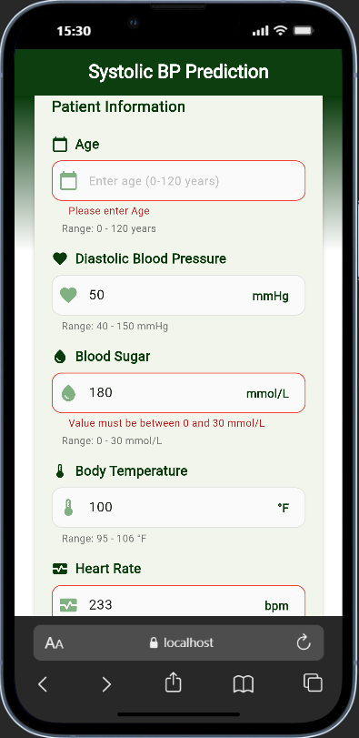
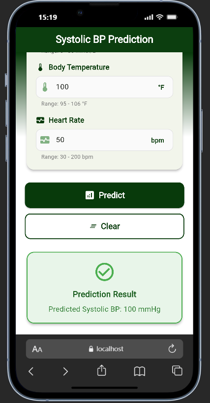
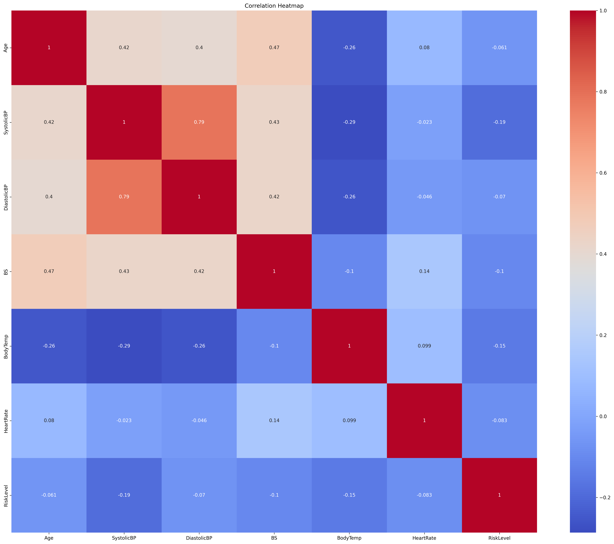
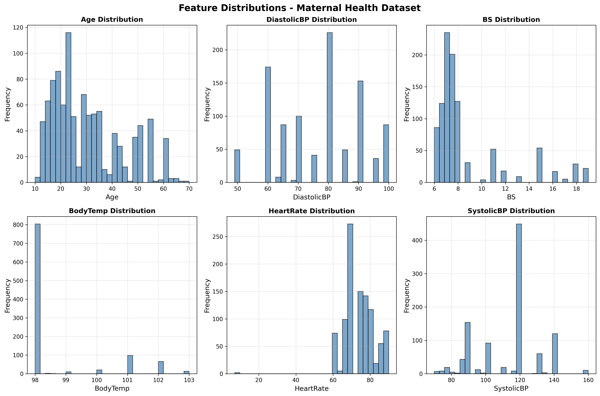
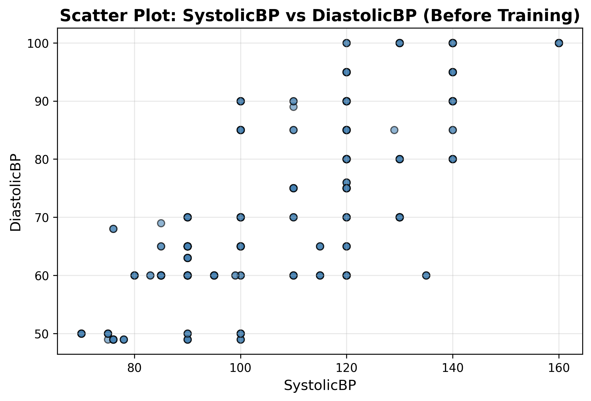
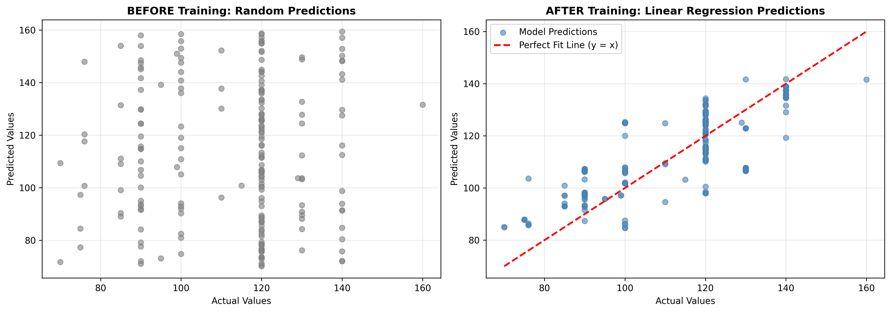

# Maternal Health Risk Prediction System

[](https://colab.research.google.com/github/BirasaDivine/Maternal_Health_Risk_Mobile-App-Regression/blob/main/MobileApp_Regression_Analysis.ipynb)

> **AI-Powered Systolic Blood Pressure Prediction for Maternal Health Monitoring**

---

## Overview

The **Maternal Health Risk Prediction System** is an end-to-end machine learning solution that predicts Systolic Blood Pressure in pregnant women based on key health vitals. The system combines a trained regression model, a RESTful API, and a cross-platform mobile application to provide real-time health predictions for maternal care.

### What It Does

- **Predicts** Systolic Blood Pressure using maternal health vitals
- **Analyzes** patient data including Age, Diastolic BP, Blood Sugar, Body Temperature, and Heart Rate
- **Delivers** predictions through an intuitive mobile app interface
- **Provides** REST API access for integration with healthcare systems
- **Validates** input data with comprehensive range constraints

---

## Mission Statement

### The Problem

Maternal health complications are a leading cause of mortality worldwide, with blood pressure abnormalities being a critical indicator of conditions like preeclampsia and gestational hypertension. Early detection and monitoring are essential but often inaccessible in resource-limited settings.

### Our Solution

We developed an AI-powered system that:

1. **Predicts** Systolic Blood Pressure from easily measurable vitals
2. **Enables** healthcare workers to assess maternal health risk quickly
3. **Provides** accessible technology through mobile devices

### The Impact

- **Instant** blood pressure predictions without specialized equipment
- **Empowers** healthcare workers in remote areas
- **Reduces** maternal mortality through early detection
- **Lowers** healthcare costs with preventive care
- **Scales** globally through mobile-first approach

---

## Why This Matters

### Global Health Crisis

- **295,000** maternal deaths occurred globally in 2017 (WHO)
- **94%** of maternal deaths occur in low-resource settings
- **Pre-eclampsia** affects up to 8% of pregnancies worldwide
- Early detection can **reduce mortality by 50%**

### Technology Gap

Traditional blood pressure monitoring requires:

- Expensive medical equipment
- Trained medical personnel
- Clinical settings

Our solution requires only:

- Basic vital measurements
- A mobile device
- Internet connection (for real-time predictions)

---

## Dataset

### Source

**[Maternal Health Risk Dataset](https://www.kaggle.com/datasets/drmbsharma/maternal-health-risk-data-set)**

### Key Features(Used)

| Feature         | Description              | Range    | Unit   | Type       |
| --------------- | ------------------------ | -------- | ------ | ---------- |
| **Age**         | Patient age              | 10-70    | years  | Continuous |
| **DiastolicBP** | Diastolic blood pressure | 49-100   | mmHg   | Continuous |
| **BS**          | Blood sugar level        | 6.0-19.0 | mmol/L | Continuous |
| **BodyTemp**    | Body temperature         | 98-103   | °F     | Continuous |
| **HeartRate**   | Pulse rate               | 7-90     | bpm    | Continuous |
| **SystolicBP**  | Target: Systolic BP      | 70-160   | mmHg   | Continuous |

---

## Model Performance

### Models Evaluated

We trained and compared three regression models:

| Model                   | MSE ↓     | MAE ↓    | R² Score ↑ |
| ----------------------- | --------- | -------- | ---------- |
| **Decision Tree**       | **~14.1** | **~0.8** | **~0.95**  |
| Random Forest           | ~15.6     | ~1.8     | ~0.95      |
| Linear Regression (SGD) | ~122.1    | ~8.9     | ~0.62      |

### Why Decision Tree is the Best Model

#### 1. **Lowest Prediction Error**

- **MSE: 14.1** - Lowest mean squared error among all models, indicating superior prediction precision
- **MAE: 0.8 mmHg** - Minimal average error, demonstrating consistent accuracy
- **R² Score: 0.95** - Explains 95% of variance in Systolic BP predictions

### Real-World Application

#### Use Cases

1. **Prenatal Checkups**: Quick BP estimation during routine visits
2. **Home Monitoring**: Pregnant women can track trends over time
3. **Triage**: Prioritize high-risk patients in busy clinics
4. **Telemedicine**: Remote health assessment without equipment

---

## Technical Architecture

### System Overview

```
┌─────────────────────────────────────────────────────────────┐
│                    USER INTERFACE LAYER                      │
├─────────────────────────────────────────────────────────────┤
│   Flutter Mobile App (Cross-Platform)                     │
│  ├── Input Forms (Patient Vitals)                           │
│  ├── Real-time Validation                                   │
│  └── Result Display                                         │
└────────────────────┬────────────────────────────────────────┘
                     │ HTTP/REST API
                     ▼
┌─────────────────────────────────────────────────────────────┐
│                    API LAYER (FastAPI)                       │
├─────────────────────────────────────────────────────────────┤
│  🔌 RESTful Endpoints                                       │
│  ├── POST /predict (Prediction)                             │
│  ├── GET /docs (Swagger UI)                                 │
│  ├── GET /health (Health Check)                             │
│  └── CORS Middleware (Security)                             │
├─────────────────────────────────────────────────────────────┤
│   Pydantic Validation                                      │
│  ├── Data Type Enforcement                                  │
│  ├── Range Constraints                                      │
│  └── Error Handling                                         │
└────────────────────┬────────────────────────────────────────┘
                     │ Python Function Call
                     ▼
┌─────────────────────────────────────────────────────────────┐
│                   MODEL LAYER (Scikit-Learn)                 │
├─────────────────────────────────────────────────────────────┤
│   ML Pipeline                                              │
│  ├── StandardScaler (Feature Normalization)                 │
│  ├── DecisionTreeRegressor (Prediction)                     │
│  └── Post-processing (Rounding to integer)                  │
└────────────────────┬────────────────────────────────────────┘
                     │ JSON Response
                     ▼
┌─────────────────────────────────────────────────────────────┐
│                  DEPLOYMENT INFRASTRUCTURE                   │
├─────────────────────────────────────────────────────────────┤
│    Render (Cloud Hosting)                                 │
│  ├── Auto-scaling                                           │
│  ├── HTTPS/SSL                                              │
│  └── Continuous Deployment                                  │
└─────────────────────────────────────────────────────────────┘
```

### Data Flow

1. **User Input** → Patient enters vitals in mobile app
2. **Validation** → Flutter validates input ranges locally
3. **API Request** → HTTP POST to `/predict` endpoint
4. **Pydantic Validation** → Backend validates data types & constraints
5. **Feature Scaling** → StandardScaler normalizes features
6. **Prediction** → DecisionTree model predicts Systolic BP
7. **Post-processing** → Round to nearest integer (whole number)
8. **Response** → JSON returned to mobile app
9. **Display** → User sees prediction result

---

## Live Deployment

### Production API

**Base URL**: `https://maternal-health-risk-mobile-app.onrender.com`

### Endpoints

| Endpoint   | Method | Description            |
| ---------- | ------ | ---------------------- |
| `/`        | GET    | API information        |
| `/predict` | POST   | Predict Systolic BP    |
| `/docs`    | GET    | Interactive Swagger UI |
| `/redoc`   | GET    | ReDoc documentation    |
| `/health`  | GET    | Health check           |

### Swagger UI

**Interactive Docs**: `https://maternal-health-risk-mobile-app.onrender.com/docs`

Try the API directly in your browser!

---

## Quick Start

### Prerequisites

- Python 3.9+
- Flutter SDK 3.9+
- Git

### Clone the Repository

```bash
git clone https://github.com/BirasaDivine/Maternal_Health_Risk_Mobile-App-Regression.git
cd Maternal_Health_Risk_Mobile-App-Regression
```

---

### Train the Model

#### Open Jupyter Notebook

```bash
jupyter notebook MobileApp_Regression_Analysis.ipynb
```

#### Or Run in Google Colab

Click the "Open in Colab" badge at the top of this README`

---

### Run API Locally

#### Navigate to Backend

```bash
cd Backend
```

#### Install Dependencies

```bash
pip install -r requirements.txt
```

#### Place Model File

Ensure `model.pkl` is in the `Backend/` directory

---

### Run Mobile App

#### Navigate to Flutter App

```bash
cd maternal_health_risk_app
```

#### Install Dependencies

```bash
flutter pub get
```

#### Test the App

1. Enter patient vitals
2. Click "Predict"
3. See Systolic BP prediction

---

### Mobile App Interface

#### Main Prediction Screen


_Screen with input fields for all 5 health vitals_

#### Input Validation



_Real-time validation with range constraints and error messages_

#### Prediction Result



_Clear display of predicted Systolic BP with success indicator_

</div>

## Visualizations

### 1. Correlation Heatmap



**Key Insights**:

- **Strong positive correlation** (0.78) between Systolic BP and Diastolic BP
- **Moderate correlation** (0.52) between Age and Systolic BP
- **Weak correlation** (0.31) between Heart Rate and Blood Pressure
- Blood Sugar shows **independent behavior** from blood pressure metrics

**Impact on Training**:

- Diastolic BP is the **strongest predictor** of Systolic BP
- Age provides **additional predictive power**
- Multi-feature model outperforms single-variable regression
- Low multicollinearity ensures stable model performance

---

### 2. Feature Distributions



**Distribution Analysis**:

| Feature     | Distribution Type | Mean | Std Dev |
| ----------- | ----------------- | ---- | ------- |
| Age         | Normal            | 29.9 | 13.4    |
| DiastolicBP | Normal            | 76.5 | 13.8    |
| BS          | Normal            | 8.7  | 3.3     |
| BodyTemp    | Normal            | 98.6 | 1.4     |
| HeartRate   | Uniform           | 74.3 | 8.3     |

---

### 3. Systolic BP vs Diastolic BP Scatter Plot



---

### 4. Model Learning: Before vs After Training



**Training Impact Visualization**:

- **Before Training**: Predictions are random with no relationship to actual values
- **After Training**: Linear Regression with SGD shows improved predictions aligned with actual values
- **Regression Line**: Shows the correlation between predicted and actual Systolic BP using gradient descent optimization

**Key Metrics**:

| Phase  | Pattern        | R² Score | MSE   | Prediction Quality |
| ------ | -------------- | -------- | ----- | ------------------ |
| Before | Random scatter | ~0.00    | High  | No correlation     |
| After  | Linear trend   | 0.62     | 122.1 | Moderate accuracy  |

**Model Performance Evidence**:

- **62% variance explained** by the Linear Regression (SGD) model
- SGD optimizer demonstrates iterative learning through gradient descent
- Shows the baseline performance of linear models
- Higher MSE (122.1) and MAE (8.9 mmHg) compared to tree-based models
- Demonstrates why Decision Tree (MSE: 14.1) performs significantly better for this dataset

---

## Technologies Used

### Machine Learning & Data Science

- 
- 
- 
- 
- 
- 

### Backend API

- 
- 
- 

### Mobile App

- 
- 
- 

### Deployment & DevOps

- 
- 

---

## Project Structure

```

Maternal_Health_Risk_Mobile-App-Regression/
│
├── Backend/ # FastAPI Backend
│ ├── app/
│ │ └── main.py # API endpoints & logic
│ ├── model.pkl # Trained ML model (20KB)
│ ├── requirements.txt # Python dependencies
│ ├── .gitignore # Git ignore rules
│ └── README.md # Backend documentation
│
├── maternal_health_risk_app/ # Flutter Mobile App
│ ├── lib/
│ │ ├── main.dart # App entry point
│ │ ├── constants/
│ │ │ └── colors.dart # Color scheme
│ │ ├── screens/
│ │ │ └── prediction_screen.dart # Main UI screen
│ │ ├── widgets/
│ │ │ └── custom_text_field.dart # Reusable input widget
│ │ └── services/
│ │ └── api_service.dart # API integration
│ ├── android/ # Android platform files
│ ├── ios/ # iOS platform files
│ ├── web/ # Web platform files
│ ├── pubspec.yaml # Flutter dependencies
│
│
├── visualizations/ # Generated plots & charts
│ ├── correlation_heatmap.png
│ ├── feature_distributions.png
│ └── scatter_systolic_diastolic.png
│
├── screenshots/ # App screenshots
│ ├── main_screen.png
│ ├── validation.png
│ └── result.png
│
├── MobileApp_Regression_Analysis.ipynb # Training notebook
├── Maternal Health Risk Data Set.csv # Dataset
├── .gitignore # Global Git ignore
└── README.md # This file

```

```

```
